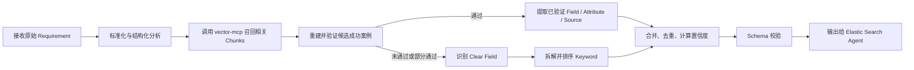
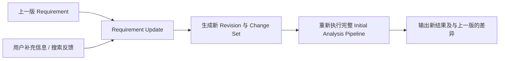

# Analyze Agent Build Plan

## 1. 文档目的

本文档定义 Analyze Agent 的第一版建设计划。Analyze Agent 是 Asset Discovery agentic team 的上游分析成员，负责把自然语言 requirement 转换为可供下游 Elastic Search Agent 执行检索的结构化搜索建议。

Analyze Agent 不直接搜索真实 Data Platform，也不负责最终确认 source asset/source attribute。它的主要职责是：

1. 理解并标准化 requirement。
2. 通过 Knowledge Base 中的历史成功案例复用已验证的 field、attribute 和 attribute source。
3. 从 requirement 中识别明确给出的 field。
4. 将无法直接映射为 field 的业务概念拆解为 keyword。
5. 接收用户对上一轮搜索结果的反馈，将补充信息合并进既定 requirement，并重新执行完整分析。
6. 生成稳定、可解释、可追踪的结构化输出，作为 Elastic Search Agent 的直接输入。

## 2. 业务上下文

### 2.1 Asset Discovery 目标

完整 Asset Discovery 流程需要建立以下关系：

```text
Requirement
  -> GDA
  -> GDA Field
  -> Source Attribute
  -> Source Asset
```

领域关系：

- 一个 GDA 由多个 field 构成。
- 一个 field 可由一个或多个 source attribute 构成。
- attribute 是 asset（例如 table）中的 column。
- 不同 asset 中可能存在同名 attribute。
- Analyze Agent 提供搜索建议；Elastic Search Agent 使用建议搜索真实 asset 和 attribute。

### 2.2 Requirement 示例

```text
因为 Basel 3 协议发生变化，ADC 审查需要进行 update，
然后构建一个 GDA 进行数据分析。
这个 GDA 可能需要 Facility_id、ADC_entity_country。
```

预期分析：

- Clear fields: `Facility_id`、`ADC_entity_country`
- Keywords: `ADC`、`Basel 3`
- Analyzed requirement: 对业务目标、监管背景、目标 GDA 和已知字段的结构化描述

## 3. 范围

### 3.1 第一版包含

- Initial Analysis：处理全新的 requirement。
- Updated Analysis：合并用户补充信息后重新分析。
- Requirement 标准化与业务概念提取。
- Knowledge Base RAG 查询及成功案例复用。
- Clear field 提取。
- Keyword 生成、规范化、去重和排序。
- 置信度计算与证据记录。
- 结构化输入/输出 schema。
- 对外调用边界，兼容未来 API 或 Agent 编排。
- 单元测试、集成测试、契约测试及可观测性。

### 3.2 第一版不包含

- 直接访问或检索 Data Platform。
- Elastic Search 查询构建和执行。
- 最终判定某个 source attribute 是否满足业务 requirement。
- GDA 的实际创建和持久化。
- Knowledge Base 中成功案例的生产写入流程。
- 完整用户界面。
- 大型工作流的最终编排技术选型。

## 4. 核心设计原则

1. **稳定契约**：核心分析逻辑与 API、Agent framework、LLM provider 解耦。
2. **证据优先**：任何高置信度建议都必须带有可追踪的来源和匹配理由。
3. **RAG 不是事实判定器**：向量相似度仅用于召回候选案例，必须再做业务一致性验证。
4. **完整重跑，可追踪更新**：补充信息先生成新 requirement revision，再重跑完整流程。
5. **确定性优先**：规则可以可靠完成的提取、合并、去重和校验不交给 LLM。
6. **允许部分结果**：Knowledge Base 或 LLM 暂时不可用时，应尽可能返回降级结果和明确警告。
7. **版本化**：prompt、schema、模型、Knowledge Base 检索配置和 requirement revision 都需记录版本。

已确认的第一版技术栈：

- Runtime：Python 3.11+。
- Agent framework：Google Agent Development Kit（ADK）。
- Model provider：Gemini，通过 API key 调用；API key 和具体 model ID 通过环境配置注入，不写死在业务逻辑中。
- 数据模型与边界校验：Python typed models；具体库在项目初始化时冻结。
- Knowledge Base：通过 vector-mcp 执行 `text in -> chunks out` 的语义检索。
- vector-mcp 已由外部 service 提供，本仓库只实现调用 adapter、响应归一化、错误处理和测试 fake，不重复开发向量检索能力。
- Knowledge Base 初始允许为空；Analyze Agent 必须将空 chunks 作为正常路径处理。
- 对外承载：优先实现为可被 ADK 编排调用的 Analyze Agent，同时保持 domain/application 层可被普通 API adapter 复用。

## 5. 两类工作流

第一版提供两个明确的 application/agent 操作：

- `analyze_initial`：创建 requirement 及首个 revision，并执行完整分析。
- `analyze_update`：根据 `requirement_id` 读取 latest revision，合并补充信息和搜索反馈，创建新 revision 后执行完整分析。

### 5.1 Initial Analysis



处理步骤：

1. 校验输入并创建 `requirement_id` 和首个 revision。
2. 生成 `analyzed_requirement`，保留原意，不擅自补充业务事实。
3. 提取显式 field 候选和业务概念。
4. 将原始 requirement、标准化 requirement、领域概念和 field 候选组合成检索 text，调用 vector-mcp。
5. 从召回 chunks 中提取案例内容，重建候选 field -> attribute -> asset mapping，并保留 chunk 引用。
6. 对重建后的候选案例执行复用验证：
   - 业务目标是否一致。
   - 监管/领域上下文是否一致。
   - field 含义是否一致，而非仅名称相似。
   - source attribute/source asset 是否来自成功记录。
   - 案例是否仍有效，是否存在版本或时效限制。
7. 对通过验证的案例产出高置信度建议。
8. 对 requirement 中明确出现但未经成功案例验证的 field 产出中置信度建议。
9. 对其余概念生成 keyword，并进行别名扩展、去重和优先级排序。
10. 返回结构化结果、证据、警告和 trace metadata。

### 5.2 Updated Analysis



更新过程不能只把补充信息拼接到文本末尾。应先提取变更语义：

- `add`：新增业务约束、field、keyword 或上下文。
- `correct`：纠正旧 requirement 中的信息。
- `remove`：明确排除 field、asset、attribute 或业务解释。
- `confirm`：确认某个搜索结果合理。
- `reject`：标记某个搜索结果不合理，并记录原因。

第一版搜索反馈 decision 只支持：

- `accept`
- `reject`

更新规则：

1. 保留 immutable 的 revision history。
2. revision ID、revision number、latest revision 查询和写入顺序全部由代码及 repository 管理，不能由 Gemini 生成或选择。
3. 更新请求使用 `requirement_id` 读取当前 latest revision；创建下一 revision 时使用 SQLite transaction 避免并发覆盖。
4. 明确纠正和排除的信息优先于历史 requirement。
5. 用户已拒绝的建议进入 negative constraints，下一轮不得无理由重复推荐。
6. 用户已确认的 asset、attribute 或 field mapping 作为反馈证据，标注来源为 `user_feedback`；是否可直接升级为 high confidence 由后续治理规则决定。
7. 每次更新后重跑 RAG、clear field 和 keyword 流程，避免局部修改导致结果不一致。
8. 每次更新生成一份完整、可独立读取的新英文 requirement，而不是仅保存增量文本。
9. 同时保留原始 `supplemental_information`、搜索反馈和结构化 change set。
10. 输出本轮相对上一轮的 `change_summary`。

## 6. 建议数据契约

### 6.1 Initial 请求

```json
{
  "request_id": "uuid",
  "requirement": "raw user requirement",
  "context": {
    "business_domain": "optional",
    "target_gda": "optional",
    "locale": "en",
    "caller": "asset-discovery-orchestrator"
  }
}
```

### 6.2 Updated 请求

```json
{
  "request_id": "uuid",
  "requirement_id": "uuid",
  "supplemental_information": "user feedback and additional requirement",
  "search_feedback": [
    {
      "candidate_id": "candidate-from-search-agent",
      "target_type": "field_mapping",
      "decision": "accept",
      "reason": "optional",
      "field_name": "ADC_entity_country",
      "asset": {
        "asset_id": "optional",
        "asset_name": "adc_entity"
      },
      "attribute": {
        "attribute_id": "optional",
        "attribute_name": "entity_country"
      }
    }
  ]
}
```

`target_type` 支持：

- `asset`
- `attribute`
- `field_mapping`

当反馈对象是 `field_mapping` 时，应尽量同时携带 field、attribute 和 asset identity。Analyze Agent 必须保留映射关系，不能把三者拆成互不相关的反馈。

### 6.3 Analyze Agent 响应

图中的 `{name, type, confidence, analyzed_requirement}` 可作为最小下游视图。正式契约将结果按用途拆分为 `clear_fields`、`keywords` 和 `reused_mappings`：

```json
{
  "schema_version": "1.0",
  "request_id": "uuid",
  "requirement_id": "uuid",
  "revision_id": "uuid",
  "analyzed_requirement": {
    "summary": "normalized business requirement",
    "business_goal": "what the user wants to achieve",
    "domain_context": ["ADC", "Basel 3"],
    "target_output": "GDA",
    "constraints": [],
    "negative_constraints": []
  },
  "clear_fields": [
    {
      "suggestion_id": "uuid",
      "name": "Facility_id",
      "confidence": {
        "level": "medium",
        "score": 0.72
      },
      "origin": "explicit_requirement",
      "priority": 1,
      "search_strategy": "exact_field_first",
      "normalized_terms": ["facility_id"],
      "matched_success_case": null,
      "source_hints": [],
      "evidence": [
        {
          "type": "requirement_span",
          "reference": "Facility_id"
        }
      ],
      "rationale": "Field name is explicitly stated by the user."
    }
  ],
  "keywords": [
    {
      "suggestion_id": "uuid",
      "name": "ADC",
      "confidence": {
        "level": "medium",
        "score": 0.68
      },
      "origin": "requirement_analysis",
      "priority": 2,
      "search_strategy": "semantic_keyword",
      "normalized_terms": ["ADC"],
      "matched_success_case": null,
      "source_hints": [],
      "evidence": [],
      "rationale": "Core business concept extracted from the requirement."
    }
  ],
  "reused_mappings": [],
  "change_summary": null,
  "warnings": [],
  "trace": {
    "prompt_version": "analyze-requirement-v1",
    "model": "configured-model",
    "knowledge_base_queries": [],
    "processing_time_ms": 0
  }
}
```

在 Elastic Search Agent 的最终契约尚未冻结前，Analyze Agent 提供以下最小稳定搜索信息：

- `clear_fields[].name/confidence/priority/search_strategy`
- `keywords[].name/confidence/priority/search_strategy`
- `reused_mappings`
- `analyzed_requirement`

暂定下游搜索语义：

- 高置信度 clear field：优先 exact field search。
- 中置信度 clear field：先 exact/normalized field search，再使用 `analyzed_requirement` 辅助打分。
- keyword：执行 semantic/fuzzy search，并使用 `analyzed_requirement` 辅助相关性打分。
- `priority` 数字越小越优先；同优先级下先按 confidence score 排序。
- success case 中已有 asset/attribute mapping 时，作为 source hint 传递，但仍由下游决定是否需要重新验证。

### 6.4 枚举建议

`origin`：

- `success_case`
- `explicit_requirement`
- `requirement_analysis`
- `user_feedback`

置信度初始语义：

- `high`：存在已验证的历史成功案例，且业务上下文、field 语义及来源信息通过复用校验；用户确认是否可直接升级为 high confidence 由治理规则决定。
- `medium`：requirement 明确给出 field 名称，但尚未验证真实 source；或高质量分析得到的核心 keyword。
- `low`：弱推断、别名扩展或上下文不足的候选。默认可保留在响应中，但下游应降低优先级。

置信度不由 Gemini 直接决定。Gemini 只输出结构化分析信号，最终 score 由规则引擎计算。

第一版评分基线：

- 已验证成功案例 mapping：基础分 `0.90`。
- requirement 明确写出的 clear field：基础分 `0.70`。
- requirement 分析得到的核心 keyword：基础分 `0.60`。
- 同义词扩展或弱推断 keyword：基础分 `0.40`。
- 用户明确拒绝：排除并记录为 negative constraint。
- 用户确认：增加 `0.10`，但是否写入 Knowledge Base 由完整 Asset Discovery 流程决定。
- chunk 证据不完整、上下文冲突或存在歧义：按规则扣分。

分数限制在 `[0, 1]`：

- `high`：`score >= 0.85`
- `medium`：`0.55 <= score < 0.85`
- `low`：`score < 0.55`

同一分组内按 score 降序生成 `priority`；clear field 整体优先于 keyword。权重通过配置维护，后续使用真实反馈校准。

## 7. Knowledge Base / vector-mcp 集成

vector-mcp 是检索工具，不是成功案例解析服务。其边界是：

```text
text -> cosine-similarity retrieval -> relevant chunks
```

vector-mcp 不负责直接返回标准化的 field、attribute、asset mapping，也不负责判断 chunk 是否足以证明一次成功复用。Analyze Agent 需要基于 chunks 自行 regenerate structured evidence。

### 7.1 检索输入

vector-mcp 单次输入为 text。Analyze Agent 可以按配置生成一次或多次检索 text：

- 完整标准化 requirement。
- 业务目标和监管背景。
- 明确 field 列表。
- 核心 keyword。
- 已知 GDA 或 domain。

### 7.2 vector-mcp 原始返回边界

adapter 将外部 service 响应归一化为：

```json
{
  "query_text": "normalized retrieval text",
  "chunks": [
    {
      "chunk_id": "string",
      "text": "retrieved knowledge-base content",
      "similarity_score": 0.87,
      "metadata": {}
    }
  ]
}
```

只有 `text` 和 chunks 是 Analyze Agent 的硬性依赖。`chunk_id`、`similarity_score` 和 `metadata` 若 MCP 未提供则允许为空，但会限制证据追踪和置信度上限。空 `chunks` 是初始阶段的预期返回，不视为错误。

### 7.3 Analyze Agent 重建的候选成功案例

以下结构不是 vector-mcp 的直接返回，而是 Analyze Agent 基于一个或多个 chunks 生成的内部 typed model：

```json
{
  "case_id": "string",
  "requirement_summary": "string",
  "domain_context": ["string"],
  "status": "success",
  "fields": [
    {
      "field_name": "string",
      "business_definition": "string",
      "attributes": [
        {
          "attribute_name": "string",
          "asset_id": "string",
          "asset_name": "string",
          "source_system": "string"
        }
      ]
    }
  ],
  "valid_from": "datetime",
  "valid_to": null,
  "version": "string"
}
```

每个重建字段还应记录 `supporting_chunk_ids` 和原文 evidence span，确保模型生成的 mapping 能回溯到 chunk。

若 chunk 只提到相似 requirement，却没有足够内容恢复 field -> attribute -> asset mapping，则可以帮助生成 keyword 或理解 requirement，但不能被视为完整成功案例。

### 7.4 复用门槛

不能仅凭 vector score 进入 high confidence。建议至少满足：

1. chunk 内容明确表达案例成功，或包含团队认可的等价成功标识。
2. requirement intent 与案例 intent 一致。
3. domain/regulatory context 不冲突。
4. field 的业务定义兼容。
5. attribute 与 asset 标识完整。
6. 没有与当前用户 negative constraints 冲突。
7. 每个复用 mapping 均可回溯到 supporting chunk，而不是由模型补全。

候选可以：

- 全量复用：案例中相关 field 全部通过验证。
- 部分复用：仅复用通过验证的 field。
- 拒绝复用：保留为 trace，不进入搜索建议。

### 7.5 MCP 适配边界

定义内部接口，避免 domain logic 依赖具体 MCP SDK：

```text
KnowledgeBaseRetriever.search(text)
  -> list[KnowledgeChunk]
```

vector-mcp binding 作为该接口的一个 ADK tool/adapter。应用层随后调用 `SuccessCaseReconstructor`，把 chunks 转换为候选案例。测试环境使用固定 fake payload，不启动或复制真实 vector-mcp service。

需要支持：

- timeout
- limited retry with backoff
- response schema validation
- correlation ID
- 若 MCP tool 支持，则配置 top-k 和相似度阈值；否则由 vector-mcp service 负责
- 熔断/降级
- 敏感数据日志脱敏

## 8. 建议模块划分

```text
src/
  analyze_agent/
    agent.py
    tools/
      vector_mcp_tool.py
  domain/
    models
    confidence
    requirement_revision
  application/
    analyze_requirement
    update_requirement
    build_search_suggestions
  ports/
    knowledge_base_retriever
    language_model
    requirement_repository
  adapters/
    vector_mcp
    llm
    api
    adk
    persistence
  prompts/
    analyze_requirement
    validate_success_case
  observability/
  config/
tests/
  unit/
  integration/
  contract/
  fixtures/
    vector_mcp/
```

建议将一次 workflow 显式建模为状态机，并由 ADK agent 负责调用 application use cases 和 vector-mcp tool。业务规则不能直接写死在 agent prompt 中：

```text
RECEIVED
  -> NORMALIZED
  -> KB_RETRIEVED
  -> CASES_VALIDATED
  -> SUGGESTIONS_BUILT
  -> VALIDATED
  -> COMPLETED

任一步骤 -> DEGRADED 或 FAILED
```

第一版调用方式：

- ADK Analyze Agent：作为 Asset Discovery agentic team 的成员，由上层 ADK 编排调用。
- ADK tool binding：连接 vector-mcp，输入 retrieval text，返回 chunks。
- Application service：实现 Initial/Updated 两类 workflow，确保 Agent 调用与未来 API 调用行为一致。
- 可选 API adapter：在总工作流确定部署形式后，将相同 application service 暴露为 HTTP endpoint。

## 9. Prompt 与结构化生成

建议至少拆为两个 prompt，而不是让单个 prompt 同时决定所有结果：

1. `analyze_requirement`
   - 生成标准化 requirement。
   - 提取显式 field、业务概念、约束和歧义。
   - 产出严格 JSON。
2. `reconstruct_and_validate_success_case`
   - 从相关 chunks 重建候选 field -> attribute -> asset mapping。
   - 对每个候选评估业务可复用性。
   - 返回可复用 field、拒绝理由和一致性分数。

Prompt 约束：

- 不允许虚构 source asset 或 source attribute。
- 未在 requirement、用户反馈或 Knowledge Base evidence 中出现的事实必须标记为推断。
- field 与 keyword 必须分开。
- 保留原始术语，同时生成 normalized term。
- 对缩写不要擅自展开；若存在多义性，记录 warning。
- 所有输出必须通过 typed schema 校验；失败时最多执行有限次数的 repair。

## 10. 持久化与状态

即使第一版仅作为 API，也建议持久化以下内容：

- requirement identity
- immutable revisions
- raw requirement
- supplemental information
- normalized requirement
- user search feedback
- output snapshot
- prompt/model/config version
- RAG case references
- processing status and error

不建议把对话历史作为唯一状态来源。Updated Analysis 必须能通过 `requirement_id + revision_id` 独立复现。

Analyze Agent 自己负责 requirement history 和 immutable revisions 的持久化。第一版使用 SQLite repository；生产数据库 adapter 可在部署约束明确后替换。revision identity、顺序和 latest pointer 均由代码及数据库约束管理，LLM 不参与版本控制。

## 11. 错误处理与降级

| 场景 | 行为 |
| --- | --- |
| 输入为空或 schema 非法 | 返回可识别的 validation error，不调用 LLM/MCP |
| requirement 信息不足 | 返回已有建议，并在 `warnings` 标明歧义；必要时由上层决定是否追问用户 |
| vector-mcp timeout | 继续 clear field/keyword 分析，结果不得标为 success-case high confidence |
| RAG 返回格式错误 | 丢弃非法 candidate，记录 warning 和 metric |
| LLM 输出 schema 错误 | 执行有限 repair；仍失败则返回 typed processing error |
| 用户反馈引用未知 candidate | 保留补充文字，但对该 feedback item 返回 warning |
| 同一 requirement 并发更新 | 通过 transaction 和 revision number 唯一约束串行化；冲突时安全重试或返回 conflict |
| 所有步骤均无法产出建议 | 返回空 suggestions、明确原因和可重试错误 |

## 12. 可观测性与安全

### 12.1 日志与 Trace

每次运行记录：

- `request_id`
- `requirement_id`
- `revision_id`
- workflow type
- stage status and latency
- MCP latency/result count
- LLM latency/token usage
- suggestion count by type/origin/confidence
- warnings/errors

不要在普通日志中记录完整敏感 requirement、attribute sample data 或凭证。

### 12.2 Metrics

- workflow success/degraded/failure rate
- p50/p95 latency
- MCP timeout/error rate
- structured-output repair rate
- average suggestion count
- success-case reuse rate
- user acceptance/rejection rate
- repeated-rejection rate
- structured-output/schema-valid rate
- 用户反馈积累量；闭环跑通后再用于质量评估

### 12.3 安全

- MCP 和模型凭证仅通过 secret/config 注入。
- 对 requirement 做 prompt injection 防护，Knowledge Base 内容视为不可信数据。
- MCP chunks 作为不可信数据处理，不能覆盖 ADK agent instruction 或触发任意额外工具调用。
- 对外响应过滤内部 prompt、凭证和不必要的 Knowledge Base 原文。
- 定义数据保留期和可删除机制。

## 13. 测试与评估计划

### 13.1 单元测试

- requirement revision 合并和冲突规则。
- clear field 规范化、去重和大小写处理。
- keyword 去重、别名和优先级。
- confidence 规则。
- negative constraints。
- output schema validation。

### 13.2 集成测试

- 使用 fake payload 测试 vector-mcp adapter 的正常、timeout、非法 chunks 和空结果。
- chunks -> success case reconstruction 的完整、部分和无证据路径。
- LLM structured output 和 repair。
- Initial 与 Updated workflow 端到端。
- persistence/revision repository。

### 13.3 契约测试

- Analyze Agent 请求/响应 schema。
- vector-mcp normalized chunk schema。
- Elastic Search Agent 所需的最小下游视图。
- schema version backward compatibility。

### 13.4 固定行为样例

当前不建设人工标注 golden set。Knowledge Base 初始默认为空，golden/success cases 仅在完整 Asset Discovery 跑通并确认成功后逐步沉淀。

开发期只维护少量非标注、非质量基准的固定输入和 fake payload，用于验证流程行为、边界条件与回归：

- requirement 明确包含多个 field。
- 仅包含业务描述，无 clear field。
- Knowledge Base 返回空 chunks。
- fake chunks 包含完整或部分 field -> attribute -> asset mapping。
- fake chunks 看似相关但不能证明 mapping。
- 同名 attribute 属于不同 asset。
- 英文缩写、多义词和大小写变化。
- 用户确认、拒绝、纠正和移除上一轮结果。
- MCP 不可用时的降级。

当前阶段验收关注 schema-valid response、workflow 分支、证据约束、错误处理和用户拒绝结果不被无理由重复推荐。Precision/recall 等质量指标推迟到 Asset Discovery 闭环产生真实成功数据后定义。

## 14. 实施阶段

### Phase 0：契约与工程骨架

交付物：

- Initial/Updated 请求 schema。
- Analyze response schema。
- vector-mcp normalized chunk schema。
- ES Agent 临时最小输入契约。
- 置信度初始规则。
- Python/ADK 工程骨架。
- vector-mcp fake payload fixtures。

完成标准：

- Analyze Agent、Knowledge Base、Elastic Search Agent 的职责边界无重叠。
- 固定示例能够通过 schema 和 workflow 行为测试。

### Phase 1：Domain Core

交付物：

- typed domain models。
- Python project/package skeleton 与 ADK agent entrypoint。
- requirement revision/update engine。
- clear field/keyword 规范化逻辑。
- confidence engine。
- schema validation。
- repository 和外部服务 ports。

完成标准：

- 无 LLM/MCP 情况下可运行全部确定性逻辑。
- 单元测试覆盖核心合并和置信度规则。

### Phase 2：LLM Analysis

交付物：

- requirement analysis prompt。
- chunk reconstruction/success-case validation prompt。
- structured output、repair 和 prompt versioning。
- fake model adapter。
- Gemini model adapter 和可配置 model ID。

完成标准：

- 固定行为样例均产出合法结构。
- 不生成无证据的 asset/attribute。

### Phase 3：Knowledge Base Service Integration

交付物：

- vector-mcp ADK tool/adapter。
- 外部 service 调用、响应归一化和 fake payload fixtures。
- chunk evidence extraction、candidate reconstruction、validation 和 partial reuse。
- timeout/retry/degraded behavior。

完成标准：

- 基于 fake payload 的正常、空结果、超时、坏响应路径均通过集成测试。
- 只有通过复用门槛的建议能获得 success-case high confidence。

### Phase 4：ADK Workflow 与对外 Adapter

交付物：

- Initial workflow。
- Updated workflow。
- `analyze_initial` 和 `analyze_update` 两个明确入口。
- ADK Analyze Agent、instruction 和 tool registration。
- 可选 API adapter 接口定义。
- idempotency、revision conflict 和错误模型。

完成标准：

- 两类 workflow 均能端到端运行。
- 同一 request 可追踪、可重放，更新不会覆盖错误 revision。

### Phase 5：Observability 与 Hardening

交付物：

- metrics、structured logging、trace。
- prompt/config regression tests。
- security review。
- runbook 和部署配置说明。

完成标准：

- 达到约定的 schema、可靠性和性能门槛。
- MCP/LLM 故障不会产生伪高置信度建议。
- 下游契约测试通过。

### Phase 6：Asset Discovery 集成

交付物：

- 接入总工作流编排。
- Elastic Search Agent contract test。
- 用户反馈回流链路。
- 小流量试运行和反馈指标。

完成标准：

- Requirement -> Analyze -> Search -> User Feedback -> Updated Analyze 闭环可运行。
- 可以从用户反馈追踪到下一 revision 及建议变化。

## 15. 推荐的第一版开发顺序

1. 冻结 Analyze 请求/响应和 normalized chunk schema。
2. 建立 Python/ADK 工程骨架与固定测试 fixtures。
3. 实现 domain models、revision engine 和 schema validation。
4. 实现 requirement analysis prompt。
5. 实现 vector-mcp 调用 adapter、chunk reconstruction 和成功案例验证。
6. 实现 suggestion merge、confidence 和 evidence。
7. 实现 Initial/Updated workflows。
8. 增加日志、metrics 和 prompt/config regression tests。
9. 与 Elastic Search Agent 做契约联调。
10. 接入完整 Asset Discovery feedback loop，并开始沉淀真实成功案例。

## 16. 风险与缓解

| 风险 | 影响 | 缓解 |
| --- | --- | --- |
| 把向量相似当成成功案例等价 | 错误 field/source 获得高置信度 | 二阶段验证、证据门槛、partial reuse |
| `field` 和 `keyword` 边界不稳定 | 下游搜索策略混乱 | 明确定义、typed enum、固定行为样例与后续真实反馈 |
| 补充信息简单拼接 | 旧信息与新纠正冲突 | revision engine、change set、negative constraints |
| LLM 自报 confidence | 置信度不可校准 | 规则化 confidence engine |
| 输出只有 name/type | 无法解释或审计 | 增加 origin、evidence、rationale、trace |
| ADK 编排逻辑渗入业务规则 | API 或其他编排方式难以复用 | ADK 只负责 orchestration，domain/application 保持独立 |
| 同名 attribute 被错误复用 | 搜到错误 asset | attribute 与 asset identity 必须成对记录 |
| 初期没有标注数据 | 暂时无法量化语义质量 | 先验证契约和行为；闭环跑通后从真实成功记录与用户反馈建立评估集 |

## 17. 已确认开发前提

1. vector-mcp 的调用模型是 `text in -> relevant chunks out`，内部通过 cosine similarity 检索。
2. vector-mcp 已开发完成且作为外部 service 运行，本仓库不开发向量检索，仅实现调用 adapter 和 fake payload 测试。
3. Knowledge Base 初始默认允许为空，不依赖任何预置成功案例。
4. Analyze Agent 负责根据 chunks regenerate structured evidence，并验证是否可复用。
5. ES Agent 至少消费 clear fields、keywords、confidence score、priority 和 `analyzed_requirement`。
6. 用户反馈覆盖 asset、attribute 和 field mapping 三种粒度。
7. 第一版使用 Python 和 Google ADK。
8. 当前不建设人工标注 golden set；真实评估数据在 Asset Discovery 闭环运行后沉淀。
9. 模型通过 Gemini API key 调用，具体 model ID 从配置读取。
10. Analyze Agent 使用 SQLite 持久化 requirement history 和 revisions；revision 全部由代码管理。
11. 输出按 `clear_fields`、`keywords`、`reused_mappings` 分组。
12. confidence score 由规则引擎计算，Gemini 不直接决定最终分数。
13. 第一版 requirement 和 supplemental information 只支持英文。
14. 第一版提供 `analyze_initial` 和 `analyze_update` 两个入口。
15. 第一版搜索反馈 decision 仅支持 `accept` 和 `reject`。
16. 每次更新生成完整的新英文 requirement，并保留原始补充信息、反馈和 change set。
